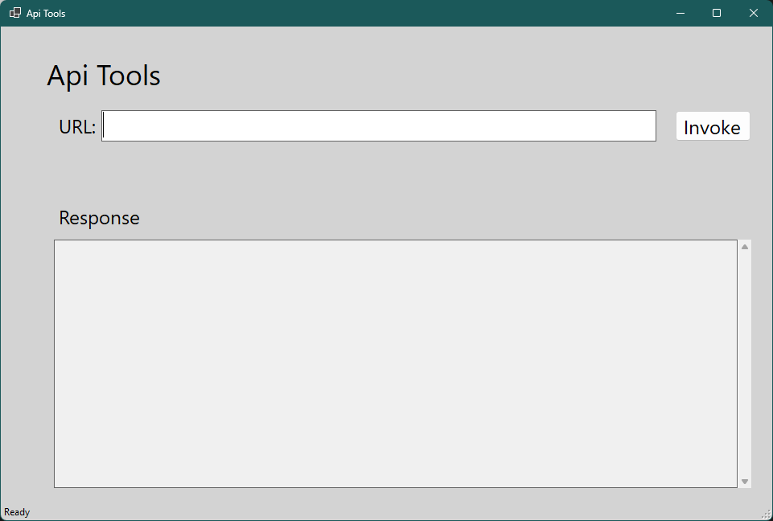
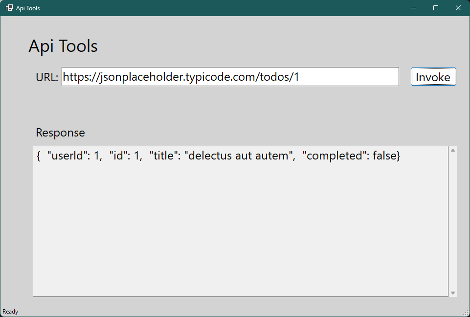

# ApiTools

Simple web api testing application to invoke GET endpoints and inspect results in JSON.

## Tech And Tools Used
- C#
- dotnet 8
- Winforms
- Visual Studio

## Get Started
1. Download `ApiTools.exe` executable from releases.
2. Run `ApiTools.exe`. User interface will look like this:

	
3. Provide URL and pclick on invoke. `Sample Url: https://jsonplaceholder.typicode.com/todos/1` You will see respnse in the response text box:

	
